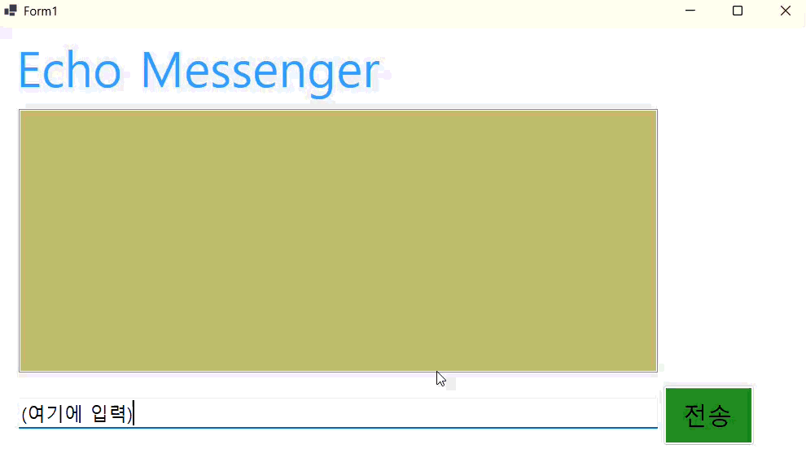
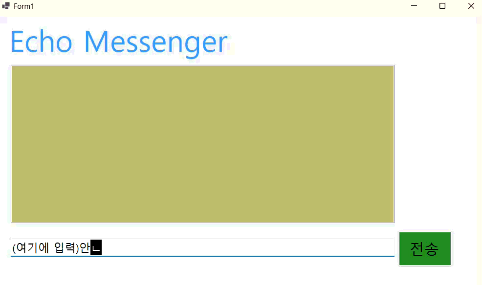
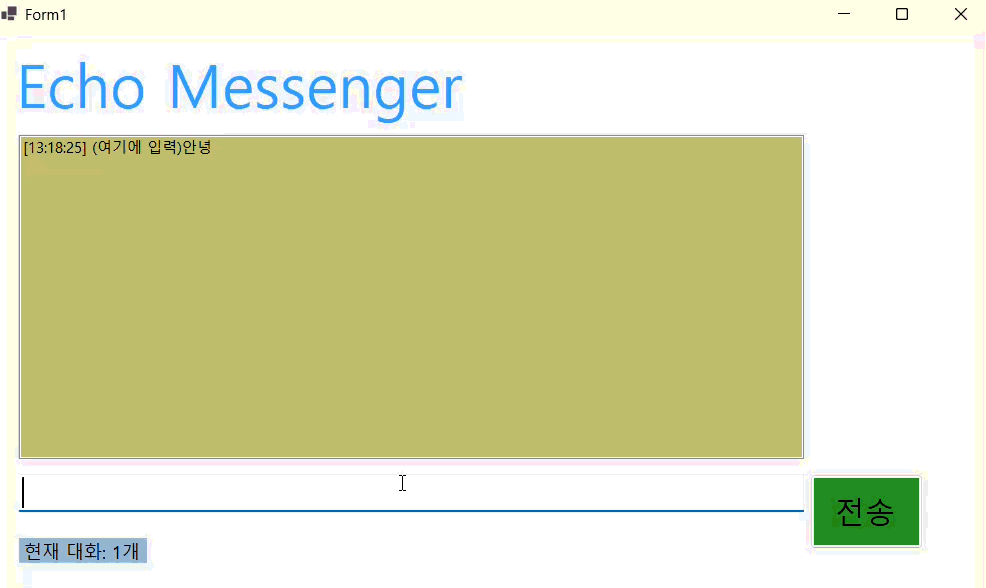

# 🖱️ 3주차 과제: 에코 메신저(Echo Messenger) (C#)
- **이름**: 김재서 (23010114)
- **학과**: 컴퓨터SW학과

---

## 📝 프로젝트 개요
- **핵심 기능**: 사용자의 키보드 입력을 실시간으로 처리하여 대화 내역에 누적하는 에코(Echo) 메신저의 기본 로직을 구현. TextBox와 ListBox 간의 데이터 전송 흐름을 제어하고, 전송 후 자동 포커스 이동을 통해 사용자 편의성을 높임.
- **사용한 플랫폼**: C#, Visual Studio 2026, .NET Windows Forms, GitHub
- **사용한 컨트롤**: 
  - 제목 라벨: `lblTitle`
  - 대화창(리스트박스): `lstEchoWindow`
  - 채팅 입력창(텍스트박스): `txtInputMessage`
  - 전송 버튼: `btnSendMessage`
- **사용한 기술과 구현한 기술**: 
  - `string` 데이터 수집 및 유효성 검사 (`IsNullOrWhiteSpace`)
  - `Items.Add()`를 활용한 데이터 동적 추가 로직
  - `Focus()` 및 `Clear()` 메서드를 활용한 사용자 경험(UX) 최적화

---

## 📸 단계별 실행 화면

### 1단계

> **상태**: 입력한 채팅 전송 버튼 클릭 시 대화창에 전송 및 텍스트 박스 내 글자 삭제 기능 구현 완료

**[과제 1 내용]**
- Label(표시), TextBox(입력), Button(전송), ListBox(대화창)를 적절히 배치.
- 전송 버튼 클릭 시 TextBox의 텍스트를 ListBox의 항목(Items)으로 추가.
- 추가 직후 TextBox의 내용을 비워(Clear) 다음 입력을 준비.

**[구현 내용과 기능 설명]**
- 입력창에 메시지 입력하고 전송 버튼을 누르면 메시지가 리스트 박스에 표시된다.
- 계속 반복하면 메시지가 리스트 박스에 한 줄씩 계속 추가된다.
- 추가 내용이 많아지면 리스트 박스에 스크롤바가 자동으로 생기고 스크롤된다.

---

## 🔍 1단계 구현 시 어려웠던 점 및 해결 방법
- **문자 전송 후에도 TextBox에 남아 있는 문장**: 
  - **문제**: 문자 전송 후에도 TextBox에 이전에 입력했던 글자가 그대로 남아 있어 매번 수동으로 지워야 하는 번거로움이 발생함.
  - **해결**: `txtInputMessage.Clear()` 함수를 호출하여 전송 직후 입력창을 초기화함. 추가로 `txtInputMessage.Focus()`를 적용하여 마우스 클릭 없이 즉시 다음 메시지를 입력할 수 있도록 UX를 개선.

---

### 2단계

> **상태**: 엔터키(Enter)를 이용한 메시지 전송 기능 및 최신 메시지 자동 스크롤 기능 구현 완료

**[과제 2 내용]**
- 사용자가 메시지 입력 후 엔터키를 누르면 전송 버튼을 클릭한 것과 동일하게 동작하도록 구현.
- 메시지 전송 후 입력창을 다시 클릭하지 않아도 자동으로 입력창에 두는 기능 구현.

**[구현 내용과 기능 설명]**
- `KeyDown` 이벤트를 사용하여 `Keys.Enter` 입력 시 `btnSendMessage.PerformClick()`이 호출해 마우스 전송 버튼 누르는 것과 같은 기능을 하게끔 설계.
- 메시지 전송 후에 마우스로 다시 누르지 않아도 입력창에 계속 커서가 있게끔 구현

---

## 🔍 2단계 구현 시 어려웠던 점 및 해결 방법
- **사용자 편의성(UX)을 위한 입력 흐름 제어**: 
  - **문제**: 과제 내용 중 "엔터키를 누르면 전송 버튼을 클릭한 것과 동일하게 동작"해야 한다는 조건이 있었음. 단순히 키 입력만 감지하면 엔터키를 칠 때마다 줄바꿈 문자가 입력되거나, 전송 버튼의 로직을 매번 새로 작성해야 하는 비효율이 발생함.
  - **해결**: `KeyDown` 이벤트 핸들러 내에서 `e.KeyCode == Keys.Enter` 조건을 사용하여 엔터키 입력을 식별함. 이후 별도의 전송 로직을 중복 작성하지 않고, 이미 구현된 `btnSendMessage.PerformClick()` 메서드를 호출함으로써 과제에서 요구하는 '전송 버튼과 동일한 동작'을 효율적으로 구현 완료.

---

### 3단계

> **상태**: 타임스탬프(시간) 결합, 문자열 정제(Trim) 및 상태 표시 라벨 구현 완료

**[과제 3 내용]**
- 메시지 전송 시 현재 시간을 대화 내용 앞에 결합하여 출력.
- 입력된 문자열의 앞뒤 공백을 제거하는 정제 과정을 추가.
- 별도의 라벨(`lblStatus`)을 통해 현재까지 누적된 메시지의 총 개수를 실시간으로 표시.

**[구현 내용과 기능 설명]**
- `DateTime.Now.ToString("HH:mm:ss")`를 활용하여 시:분:초 형태의 시간 데이터를 메시지와 결합함.
- `String.Trim()` 메서드를 적용하여 불필요한 공백이 데이터 저장소(ListBox)에 포함되지 않도록 데이터 품질을 개선함.
- `Items.Count` 속성을 참조하여 리스트박스 내 전체 메시지 개수를 사용자에게 시각적으로 제공함.

---

## 🔍 3단계 구현 시 어려웠던 점 및 해결 방법
- **데이터 정제 및 상태 동기화**: 
  - **문제**: 사용자가 실수로 입력한 앞뒤 공백이 그대로 전송되어 대화창의 가독성을 해치고, 메시지 전송 시점과 하단 상태 라벨의 개수 업데이트가 일치해야 하는 로직 구현이 필요했음.
  - **해결**: 입력 받은 문자열에 즉시 `Trim()` 메서드를 실행하여 데이터를 정제한 뒤 가공함. 또한, 버튼 클릭 이벤트 내부에서 리스트박스에 아이템이 추가된 직후 `Items.Count`를 호출하여 상태 라벨을 즉시 업데이트함으로써 데이터와 UI의 동기화를 완료

---

### 4단계
!
> **상태**: 

---

## 🔍 4단계 구현 시 어려웠던 점 및 해결 방법
- ****: 
  - **문제**: 
  - **해결**: